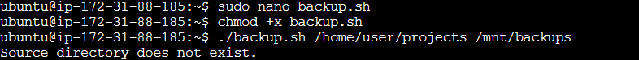
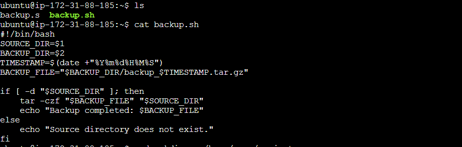
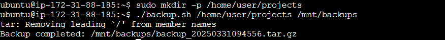
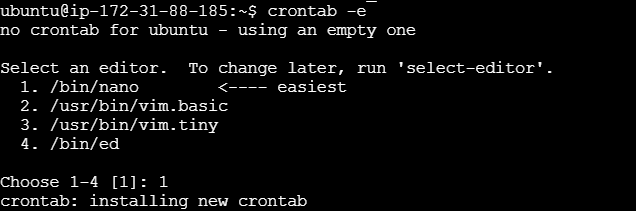
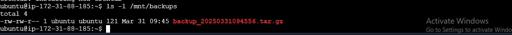

# Backup-Script

## Create a Backup Script
sudo nano backup-sh

## Make the Script Executable
chmod +x backup.sh

## Run the Script
./backup.sh /home/user/projects /mnt/backups

## Schedule the Script with Cron
crontab -e

## Verify the Backup
ls -l /mnt/backups
